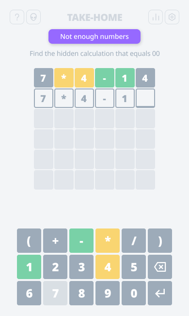
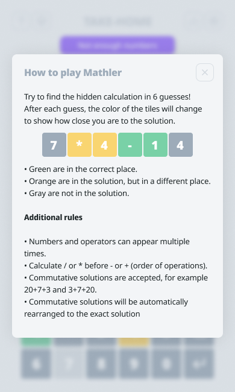

# mathler (take-home)

> Ellapsed time: 8h (3h on research, requirements and design, 5h on setup, theme, base components and layout)
> Approach: create a 80/20 POC, meaning that's 80% functional but able to showcase a little of each skill
> Goal:
>  

#### FIRST THOUGHTS

- it's a math problem
- can it be solved with regex or does thinking in regex helps solve the problem?
- with 6 slots the maximum num of operators is 2 and there is always at least 1 operator
- if one of the operators is \* or / then there is only one solution
- commutative solutions are accepted, how will I solve this? one solution with multiple sub-solutions (sounds meh)? some sort of smart equation? split by operator and validate each group and then each slot (sounds promissing, perhaps with an array and find where all groups need to match)?

#### RANDOM QUESTIONS AND FINDINGS

- do I need to validate if the input calculation actually equals the solution? (just checked that there is a validation for that)
- can I select and edit a slot before pressing Enter instead of pressing Delete multiple times? (it's not allowed)
- if the game window goes into second plan or we switch into another tab and get back to the game, what was typed is cleared
- local storage has the solution from the get-go
- grayed out numbers/operators can still be selected, they just loose their hover state
- feedback and validation are presented to the user on a toast
- game has interesting settings, including multiple difficulty levels, can I achieve a scalable solution?
- menu: how to play, title, settings, stats
- "0" is placed at the beginning, does it make sense to have it at the end like in keyboards? (I keep going to the end looking for it)
- what about a different layout for the game inputs?
- there is a countdown at the end of the game (win or lose doesn't matter)
- a new problem to solve every 24h
- accessibility
- i18n

#### STACK

- React (vite), TypeScript, Emotion (styled-objects), Jest/Vitest
- no e2e tests planned atm (no Playwright), least amount of dependencies (no Framer Motion, no Tailwind)
- mobile only
